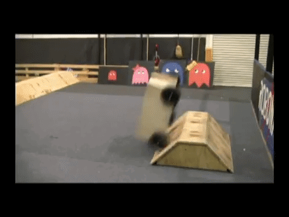

# Driver Station Wall

The Driver Station wall is a 8' wall separating the robot drivers from the robots on the field.  
The wall is created from Driver Stations, Driver Station Braces, and any season specific field elements integrated into the wall.  
The goal is to prevent this.  
.  

