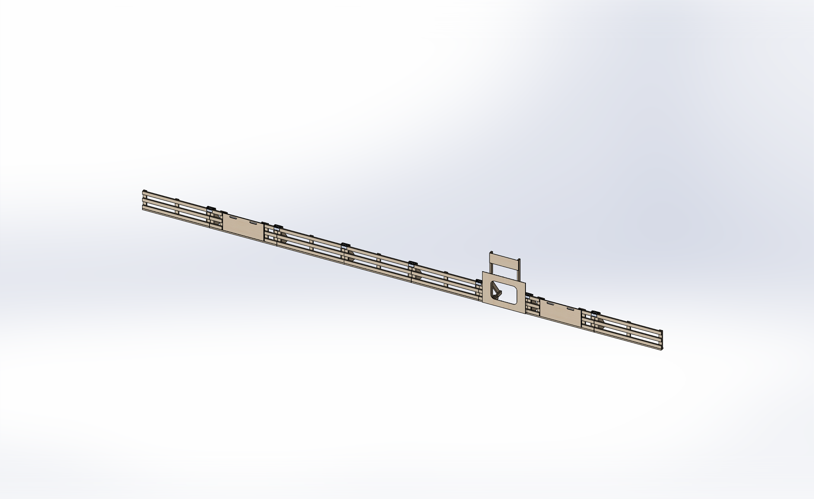

# Perimeter

The Perimeter is a 20" tall wall that encloses the field.  
The purpose of the perimeter is to provide a clear boundary for the field, safely separating robots and humans.  
The Perimeter is constructed from Wall Segments, Gate Segments, Perimeter Braces, Field clips, and any additional season specific field elements.  

